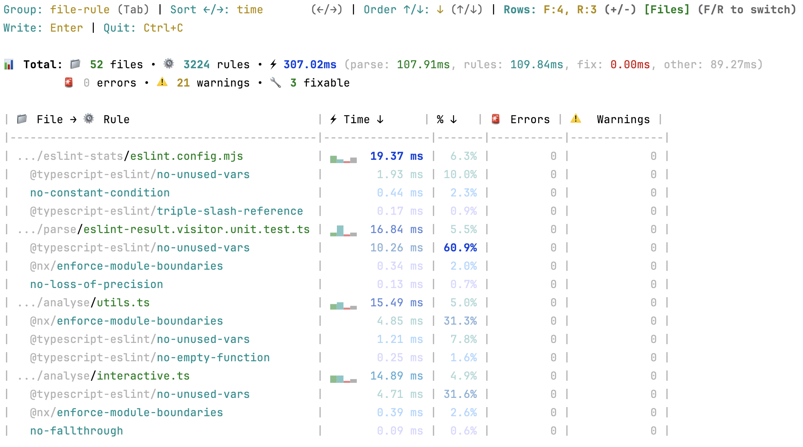
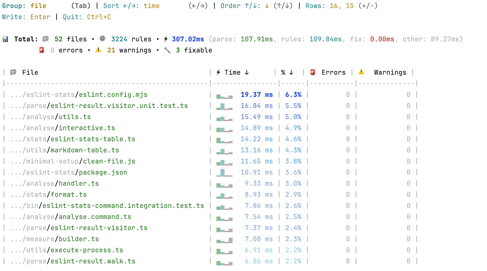
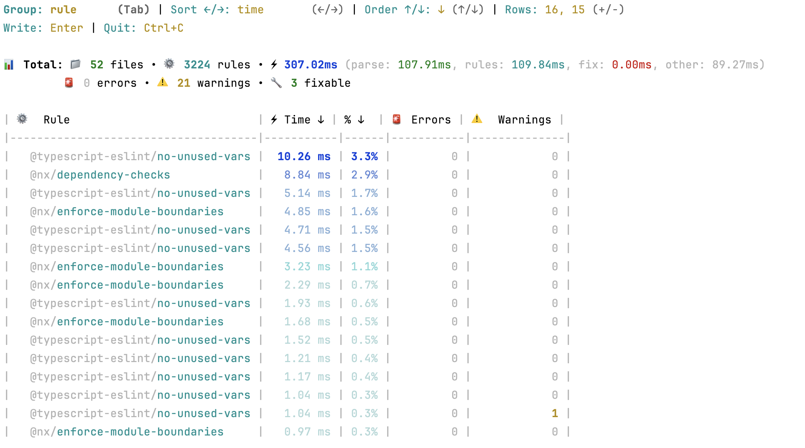

# @push-based/eslint-stats

---

## ESLint Performance Analysis and Reporting

The `@push-based/eslint-stats` package provides tools and utilities for collecting, and analyzing ESLint timing
profiles.
Measure, sort, filter, print, voilà.

## Features

- **ESLint Performance Analysis**:
  - Analyze ESLint timing statistics from a JSON file.
  - Group results by rule, file, or a combination of file and rule.
  - Sort the aggregated results by time consumption or violation count.
  - Interactive mode to dynamically explore the timing data.
  - Export analysis results to a Markdown file for documentation and sharing.
- **TypeScript API**:
  - Programmatic access to all core features.
  - Use it in your own tools and workflows.

---

## How to Generate ESLint Stats

To create ESLint output you just execute it

```bash
npx eslint .
```

This generates the following output:

```text
/Users/user/project/path/to/e2e-setup.ts
  42:28  warning  '_' is defined but never used  @typescript-eslint/no-unused-vars

/Users/user/project/path/to/process.ts
  200:3  error  Expected an assignment or function call and instead saw an expression  @typescript-eslint/no-unused-expressions
  41:25  warning  Unexpected any. Specify a different type  @typescript-eslint/no-explicit-any
  214:5  error  Definition for rule 'functional/no-let' was not found                  functional/no-let

✖ 38 problems (8 errors, 30 warnings)
  0 errors and 3 warnings potentially fixable with the `--fix` option.
```

The top part is a listing of all files and its issues, followed by a summary of the total number of problems found,
including errors and warnings.

To analyze your ESLint performance, you first need to generate a statistics file. You can do this by running ESLint with
the `--stats` flag and formatting the output as JSON.

```bash
# Options:
# Output:
#   `-o`, `--output-file` path::String   Specify file to write report to
#   `-f`, `--format` String              Use a specific output format - default: stylish
# Miscellaneous:
#  `--stats`                          Add statistics to the lint report - default: false
#  `--format` String              Use a specific output format - default: stylish
# $ command [...args] -o <file-path> -f json --stats
npx eslint . -o eslint-stats.json -f json --stats
```

You can add an environment variable to use eslints native printing to see [N] results in the terminal.
And optionally, skip the output file and use the native printing.

```bash
# Environment:
# `TIMING` Number  Prints aggregated rule timing stats in the terminal - default: 10
# $ENV_VAR command [...args] --stats
TIMING=true npx eslint . --stats
TIMING=10 npx eslint . --stats
TIMING=all npx eslint . --stats
```

---

## Installation

```bash
npm install @push-based/eslint-stats
```

---

## CLI Usage

This guide provides instructions for using the `@push-based/eslint-stats` CLI.

### `measure` command

**Usage:**

```bash
npx @push-based/eslint-stats measure [args...] [options...]
```

**Description:**
Runs ESLint on a given set of files and measures timing stats. This command is a wrapper around the ESLint CLI, adding
the ability to capture timing statistics.

**Arguments:**

| Argument        | Type       | Description                                                                                                                        |
| --------------- | ---------- | ---------------------------------------------------------------------------------------------------------------------------------- |
| **`[args...]`** | `string[]` | Arguments for ESLint, e.g., files, globs, or commands like `nx run my-app:lint`. If omitted, ESLint runs on the current directory. |

**ESLint Options:**

| Option              | Alias | Type     | Description                         |
| ------------------- | ----- | -------- | ----------------------------------- |
| **`--config`**      | `-c`  | `string` | Path to the ESLint config file.     |
| **`--output-file`** | `-o`  | `string` | File to write the ESLint output to. |

**Stats Options:**

| Option              | Type      | Default | Description                                      |
| ------------------- | --------- | ------- | ------------------------------------------------ |
| **`--report-path`** | `string`  |         | File to write the stats to.                      |
| **`--show`**        | `boolean` | `true`  | Show the stats report after running the command. |
| **`--interactive`** | `boolean` | `true`  | Show the stats report as an interactive table.   |

**Examples:**

- `eslint-stats measure "src/**/*.ts"` - Lint all TypeScript files in the `src` directory.
- `eslint-stats measure "src/**/*.ts" --config ./.eslintrc.ci.js --output-file eslint-report.json` - Lint files with a
  specific config and output file.
- `eslint-stats measure "src/**/*.ts" --file-output stats.json` - Lint files and save performance statistics to
  `stats.json`.
- `eslint-stats measure nx run project-name:lint` - Lint files using a command.

### `analyse` command

**Usage:**

```bash
npx @push-based/eslint-stats analyse <file> [options...]
```

**Description:**
Analyzes an ESLint statistics JSON file to provide insights into rule performance and violation counts. It can display
the results in the console or save them to a Markdown file. An interactive mode is available for a more dynamic analysis
experience.

**Arguments:**

| Argument     | Type     | Description                        |
| ------------ | -------- | ---------------------------------- |
| **`<file>`** | `string` | Path to the ESLint stats JSON file |

**Options:**

| Option                | Alias | Type      | Default         | Description                                                                                              |
| --------------------- | ----- | --------- | --------------- | -------------------------------------------------------------------------------------------------------- |
| **`--groupBy`**       | `-g`  | `string`  | `rule`          | Group by "rule", "file", or "file-rule". Choices: `rule`, `file`, `file-rule`.                           |
| **`--sortBy`**        | `-s`  | `string`  | `time`          | Sort by "time" or "violations". Choices: `time`, `violations`.                                           |
| **`--sortDirection`** | `-d`  | `string`  | `desc`          | Sort direction "asc" or "desc". Choices: `asc`, `desc`.                                                  |
| **`--take`**          | `-t`  | `array`   |                 | The number of entries to display. For `file-rule` group, two values can be provided for files and rules. |
| **`--outPath`**       |       | `string`  |                 | Path to the output file. Defaults to the input file name with a .md extension.                           |
| **`--interactive`**   |       | `boolean` | `true` (if TTY) | Interactive mode to dynamically explore the performance data.                                            |

**Examples:**

- `eslint-stats analyse ./eslint-stats.json` - Analyze the stats file with default options.
- `eslint-stats analyse ./eslint-stats.json --groupBy file` - Group the statistics by file.
- `eslint-stats analyse ./eslint-stats.json --sortBy violations` - Sort the results by the number of violations.
- `eslint-stats analyse ./eslint-stats.json --groupBy file-rule --take 5 3` - Display only the top 5 files and top 3
  files and 3 rules.
- `eslint-stats analyse ./eslint-stats.json --outPath ./performance-report.md` - Save the analysis to a Markdown file.

#### Interactive Mode

When you run the `analyse` command in an interactive terminal, it will start in interactive mode by default. This mode
allows you to change the grouping, sorting, and other options on the fly by pressing keys, providing a powerful way to
explore your ESLint performance data without re-running the command multiple times.

##### Total Stats

📊 **Total:** 📁 **52** files • ⚙️ **3224** rules • ⚡ **278.63ms** (parse: 110.65ms, rules: 89.00ms, fix: 0.00ms, other:
78.98ms)
🚨 **7** errors • ⚠️ **21** warnings • 🔧 **6** fixable

##### Keybindings

- `←/→` - Sort ←/→: `time` or `violations`
- `↑/↓` - Order ↑/↓: `asc` or `desc`
- `+/-` - Rows: `10` (`File` or `Rule`) or `5 3` (`File` and `Rule`)
  - `F/R` - F:`10`, R:`10`: `File` or `Rule`
- `Tab` - Group: `rule` or `file` or `file-rule`
- `Enter` - Write to report-output: `<eslint-stats-file-name>.md`
- `Ctrl+C` - Quit: Ctrl+C

##### Table View

The table view is a dynamic view of the stats data. It is updated in real-time as you change the options.
The data is color graded, and ensiched with small ascii charts.

|                                📁 File → ⚙️ Rule                                |                                📁 File                                |                                ⚙️ Rule                                |
| :-----------------------------------------------------------------------------: | :-------------------------------------------------------------------: | :-------------------------------------------------------------------: |
|  |  |  |

When you hit the enter key, the current stta is sent to a mark-down file. This is useful to share findings with your team.

| 📁 File → ⚙️ Rule                                |       ⚡ Time ↓ |   % ↓ | 🚨 Errors | ⚠️ Warnings |
| :----------------------------------------------- | --------------: | ----: | --------: | ----------: |
| .../eslint-stats/eslint.config.mjs               | `▄▂▁▃` 20.57 ms |  7.4% |         0 |           0 |
| - @typescript-eslint/no-unused-vars              |         2.03 ms |  9.9% |         0 |           0 |
| - @typescript-eslint/triple-slash-reference      |         0.20 ms |  1.0% |         0 |           0 |
| .../bin/eslint-stats-command.integration.test.ts | `▄▄▁▂` 18.36 ms |  6.6% |         1 |           1 |
| - @nx/enforce-module-boundaries                  |         4.87 ms | 26.5% |         1 |           0 |
| - @typescript-eslint/no-unused-vars              |         1.35 ms |  7.4% |         0 |           1 |
| .../stats/eslint-stats-table.ts                  | `▅▂▁▂` 17.15 ms |  6.2% |         2 |           0 |
| - @typescript-eslint/no-unused-vars              |         1.21 ms |  7.0% |         0 |           0 |
| - @nx/enforce-module-boundaries                  |         0.75 ms |  4.4% |         0 |           0 |
| .../eslint-stats/package.json                    | `▁▇▁▁` 15.76 ms |  5.7% |         2 |           0 |
| - @nx/dependency-checks                          |        13.56 ms | 86.0% |         2 |           0 |
| .../analyse/interactive.ts                       | `▅▂▁▂` 14.72 ms |  5.3% |         0 |           6 |
| - @typescript-eslint/no-unused-vars              |         1.21 ms |  8.2% |         0 |           4 |
| - @nx/enforce-module-boundaries                  |         1.07 ms |  7.2% |         0 |           2 |

---

## Additional Resources

- [ESLint Command Line Interface](https://eslint.org/docs/latest/use/command-line-interface) - Official ESLint CLI
  documentation.
- [ESLint Timing](https://eslint.org/docs/latest/extend/stats#enable-stats-collection) - Usage instructions for the
  stats flag.
