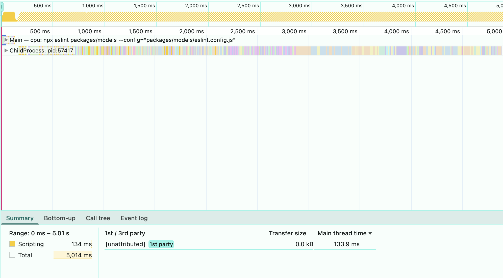
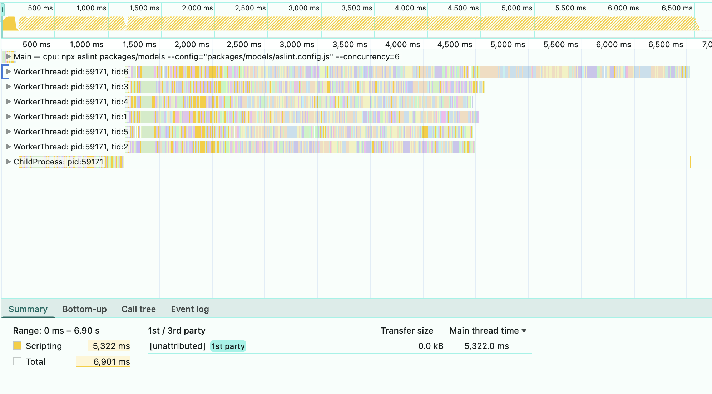

# ESLint Concurrency Benchmark

As a performance enthusiast I couldn't wait to try out the new [ESLint v9.34+ `--concurrency` option](https://eslint.org/blog/2024/06/eslint-v9.34.0-released/#new--concurrency-option) and see how it performs across different projects and concurrency settings.
In the following, you will find all scripts I used as well as some explanation. 
I will also add my measures as example output. If I have enough cross-checks, I will aggregate a more official comparison.

## General setup

To have a comparable setup, I created a set of defaults and code targets that are shared across all tests.

### Environment Variables

_.env_
```bash
# == ESLINT ==

# Eslint timing logs (needs --stats in args; first 15 sorted by time ascending)
TIMING=15

# Ensure verbose logging is off (default, but explicit)
export NX_VERBOSE_LOGGING=false

# == Nx ==
# Many flags are shorthands and disable multiple other features. 
# The below settings are DO contain duplicates for clarity.

# Disable Nx TUI
export NX_TUI=false           # Disable Nx terminal UI

# Disable Terminal UI (TUI) - no interactive interface
export NX_TUI=false

# Use simple, non-dynamic output (CI-style)
export NX_TASKS_RUNNER_DYNAMIC_OUTPUT=false

# Disable log grouping
export NX_SKIP_LOG_GROUPING=true

# Disable generation logging (if using generators)
export NX_GENERATE_QUIET=true


# Disable all caching
export NX_SKIP_NX_CACHE=true           # Disable local cache
export NX_SKIP_REMOTE_CACHE=true       # Disable remote cache (Nx Cloud)

# Disable daemon
export NX_DAEMON=false                  # Disable Nx daemon process

# Disable parallelization
export NX_PARALLEL=1                    # Run tasks sequentially (1 at a time)

# Disable batching
export NX_BATCH_MODE=false              # Disable task batching
```

### EsLint command

```bash
# Base eslint command assuming all env vars are set
npx eslint@<version> --config=<eslintconfig> --stats
# Version comparison command
npx eslint@8.10.0 --config=<eslintconfig> --stats
npx eslint@9.34.0 --config=<eslintconfig> --stats
# Concurrency flag comparison command (values are: off,1,2,4,6,8,auto)
npx eslint@9.34.0 --config=<eslintconfig> --stats --concurrency=<concurrency>
```

## Scheduling and CPU profiling

In this section, I measure how the scheduling is implemented and how the work is distributed across threads.

### Profiling Script

```bash
# Profile CPU usage while running ESLint
npx @push-based/cpu-prof@latest -- \
  npx eslint -c packages/lib-a/eslint.config.js \
  "packages/lib-a/**/*.ts" \
  --concurrency=4
```

What this does:
- Starts ESLint with Node CPU profiling enabled and collects `.cpuprofile` files
- Merges them into a single Chrome trace JSON for easy inspection `trace.json

### Example File Output

```txt
root/
 └── profiles/
     ├── CPU-<default-name>.cpuprofile
     ├── MAIN-CPU-<default-name>-<command-as-base64>.cpuprofile
     └── trace.json # Merged trace JSON for DevTools
```

### DevToolsExample Output

| 8.10.0  | 9.34 Concurreny off | 9.34 Concurreny 6 |
| ------- | -------------- | ------------- |
|   |         |        |

## Benchmarking the different eslint versions (default behavior)

In this section, I benchmark the different eslint versions independent of the `--concurrency` option.

## Benchmarking the `--concurrency` option in Eslint v9.34+

In this section, I benchmark the `--concurrency` option across different targets and concurrency settings.

```bash
node --import tsx ./eslint-concurrency-bench.ts \
   --config=packages/lib-a/eslint.config.js
  --patterns="packages/lib-a/**/*.ts,packages/lib-a/**/*.tsx" \
  --concurrency=off,1,2,4,6,8,auto \
  --runs=3 \
  --verbose
```

### Terminal Output Example

```bash
📁 Target: packages/lib-a (files: 106, ts: 101, js: 5)
  🔧 Concurrency: off
    Run 1/3 ...
      $ npx eslint --config="packages/lib-a/eslint.config.js" --concurrency=off --format=json "packages/lib-a/**/*.ts"
      Time: 8.764s, Files: 101, Errors: 0, Warnings: 0
    Run 2/3 ...
    ✅ Avg: 9.49s (min 9.385s, max 9.615s, ±0.095s)
...

✅ Benchmark complete
Raw results: tools/eslint-perf/results/eslint-benchmark-2025-08-23T01-39-46-558Z.json
Summary: ./eslint-perf/eslint-benchmark-2025-08-23T01-39-46-558Z.summary.md

Fastest per target:
Target                        Best    Avg(s)    Baseline(s)   Speedup
---------------------------------------------------------------------
packages/lib-a                off     8.849     8.849         1.00x

Per-target breakdown (best marked with ★):

packages/lib-a
Concurrency   Avg(s)    StdDev    Speedup   Mark
------------------------------------------------
off           8.849     0.078     1.00x     ★
1             9.024     0.094     0.98x     
2             9.615     0.107     0.92x     
4             9.742     0.190     0.91x     
6             11.652    0.439     0.76x     
8             13.749    0.195     0.64x     
auto          9.490     0.095     0.93x     
```

## Nx Plugin to apply in existing projects

In any project, you can apply the following plugin to enable the `--concurrency` option.

_plugin.js_
```ts
import { dirname } from 'node:path';

function buildEslintCommand({
                              eslintVersion,
                              maxWarnings = 0,
                              patterns,
                              config,
                            }) {
  const eslintCmd = eslintVersion
    ? `npx -y eslint@${eslintVersion}`
    : 'npx eslint';

  return [
    eslintCmd,
    `--config ${config}`,
    ...(maxWarnings ? [`--max-warnings ${maxWarnings}`] : []),
    '--no-error-on-unmatched-pattern',
    '--no-warn-ignored',
    patterns.join(' '),
  ]
    .filter(Boolean)
    .join(' ');
}

const createNodesV2 = [
  '**/project.json',
  async (projectConfigurationFiles, opts = {}, context) => {
  
    if (!Array.isArray(projectConfigurationFiles) || projectConfigurationFiles.length === 0) {
      return [];
    }

    const {
      patterns = ['.'],
      targetName = 'lint',
      maxWarnings = 0,
      config = 'eslint.config.ts',
      eslintVersion = undefined,
    } = opts;

    const versionedTargetName = eslintVersion
      ? `${targetName}-${eslintVersion.replace(/\./g, '')}`
      : targetName;

    return await Promise.all(
      projectConfigurationFiles.map(async (projectConfigFile) => {
        const projectRoot = dirname(projectConfigFile);
        const result = {
          projects: {
            [projectRoot]: {
              targets: {
                [versionedTargetName]: {
                  executor: 'nx:run-commands',
                  options: {
                    command: buildEslintCommand({
                      eslintVersion,
                      maxWarnings,
                      config,
                      patterns
                    }),
                  },
                  metadata: {
                    description: `Run eslint${eslintVersion ? `@${eslintVersion}` : ''}`,
                    technologies: ['eslint'],
                  },
                  cache: false,
                },
              },
            },
          },
        };
        
        return [projectConfigFile, result];
      })
    );
  },
];

const plugin = {
  createNodesV2,
  name: 'eslint-benchmark-target',
};

export default plugin;
```

_nx.json_
```json
{
  "$schema": "./node_modules/nx/schemas/nx-schema.json",
  "plugins": [
    {
      "plugin": "./tools/src/eslint-concurrency-target/eslint-concurrency-target.plugin.js",
      "options": {
        "eslintVersion": "9.34.0"
      }
    },
    {
      "plugin": "./tools/src/eslint-concurrency-target/eslint-concurrency-target.plugin.js",
      "options": {
        "eslintVersion": "8.57.0"
      }
    }
  ]
}

```

## GitHub Actions

This is the GitHub Actions workflow that I used to benchmark the different eslint versions and concurrency settings across large codebases managed by Nx DevTools.

**Job Matrix `eslint-version-benchmark`:**

|      Version/OS |  ubuntu-latest   |  windows-latest  |  macos-latest   |
|----------------:|:----------------:|:----------------:|:---------------:|
| `eslint@8.10.0` |        ✅         |        ✅         |        ✅        |
| `eslint@9.34.0` |        ✅         |        ✅         |        ✅        |

**Job Matrix `eslint-concurrency-benchmark`:**

|       Concurrency/OS |  ubuntu-latest   |  windows-latest  |  macos-latest   |
|---------------------:|:----------------:|:----------------:|:---------------:|
|  `--concurrency=off` |        ✅         |        ✅         |        ✅        |
|    `--concurrency=2` |        ✅         |        ✅         |        ✅        |
|    `--concurrency=4` |        ✅         |        ✅         |        ✅        |
|    `--concurrency=6` |        ✅         |        ✅         |        ✅        |
| `--concurrency=auto` |        ✅         |        ✅         |        ✅        |


```yml
name: ESLint Benchmarks

on:
  push:
    branches: [main]

env:
  NX_NON_NATIVE_HASHER: true
  NX_CLOUD_ACCESS_TOKEN: ${{ secrets.NX_CLOUD_ACCESS_TOKEN }}
  # Disable Nx optimizations for clean perf measurement
  NX_TUI: false
  NX_TASKS_RUNNER_DYNAMIC_OUTPUT: false
  NX_SKIP_LOG_GROUPING: true
  NX_GENERATE_QUIET: true
  NX_PERF_LOGGING: false
  NX_SKIP_NX_CACHE: true
  NX_SKIP_REMOTE_CACHE: true
  NX_DAEMON: false
  NX_PARALLEL: 1
  NX_BATCH_MODE: false
  NX_VERBOSE_LOGGING: false
  # Show timing for 15 slowest files
  TIMING: 15

jobs:
  eslint-version-benchmark:
    runs-on: ${{ matrix.os }}
    name: eslint@${{ matrix.eslint }} (${{ matrix.os }})
    strategy:
      matrix:
        os: [ubuntu-latest, windows-latest, macos-latest]
        eslint: ['8.10.0', '9.34.0']
    steps:
      - name: Checkout repository
        uses: actions/checkout@v4
        with:
          fetch-depth: 0
      - name: Set up Node.js
        uses: actions/setup-node@v4
        with:
          node-version-file: .nvmrc
          cache: npm
      - name: Install dependencies
        run: npm ci
      - name: Use ESLint version ${{ matrix.eslint }}
        run: npm i -D eslint@${{ matrix.eslint }}
      - name: Run lint (versions)
        run: npx nx run-many -t lint --exclude models-transformers --stats

  eslint-concurrency-benchmark:
    runs-on: ${{ matrix.os }}
    name: concurrency=${{ matrix.concurrency }} (${{ matrix.os }})
    strategy:
      matrix:
        os: [ubuntu-latest, windows-latest, macos-latest]
        concurrency: ['off', '2', '4', '6', 'auto']
    steps:
      - name: Checkout repository
        uses: actions/checkout@v4
        with:
          fetch-depth: 0
      - name: Set up Node.js
        uses: actions/setup-node@v4
        with:
          node-version-file: .nvmrc
          cache: npm
      - name: Install dependencies
        run: npm ci
      - name: Run lint (concurrency ${{ matrix.concurrency }})
        run: npx nx run-many -t lint --exclude models-transformers --stats --concurrency ${{ matrix.concurrency }}
```
